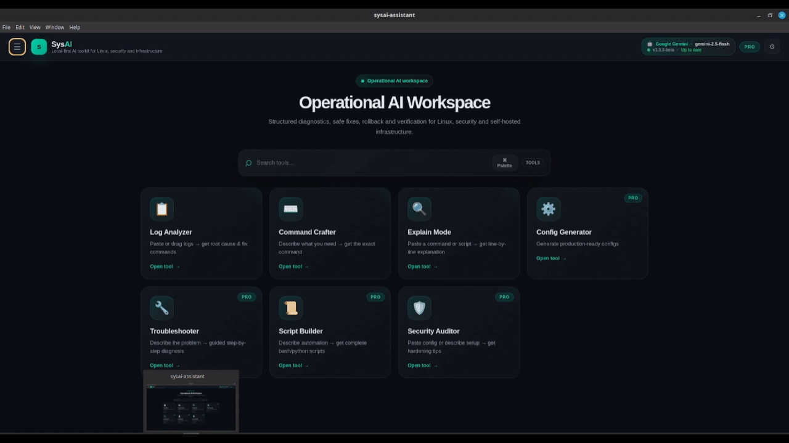

<p align="center">
  
</p>

<h1 align="center">SysAI</h1>

<p align="center">
  <strong>Operationally-aware AI workspace for infrastructure, security and self-hosted operations</strong>
</p>

<p align="center">
  <em>Built for infrastructure operators, self-hosters and security workflows.</em>
</p>
<p align="center">
  <a href="https://github.com/sponsors/shadowbipnode">
    
  </a>
</p>
<p align="center">
  
</p>

<p align="center">
  <strong>Environment-aware diagnostics • rollback-aware remediation • structured operational workflows</strong>
</p>

<p align="center">
  <a href="#-why-sysai">Why SysAI</a> •
  <a href="#-what-makes-sysai-different">What makes SysAI different?</a> •
  <a href="#-features">Features</a> •
  <a href="#-privacy-model">Privacy</a> •
  <a href="#-installation">Installation</a> •
  <a href="#-architecture">Architecture</a> •
  <a href="#-roadmap">Roadmap</a>
</p>

---

# ❓ Why SysAI

Most AI tools for infrastructure and operational workflows still behave like generic chatbots.

SysAI tries to solve a different problem.

Instead of focusing on conversational interactions, SysAI is designed around operational workflows:

* log analysis
* troubleshooting
* security auditing
* script generation
* configuration generation
* infrastructure diagnostics
* verification and rollback workflows

The goal is making AI outputs feel operationally useful instead of conversational.

SysAI focuses on operational trust, remediation safety and infrastructure-aware reasoning instead of generic AI conversation.

---

# 🧠 What makes SysAI different?

## Generic AI chat vs SysAI

| Generic AI chat           | SysAI                                       |
| ------------------------- | ------------------------------------------- |
| Long prompts every time   | Specialized operational tools               |
| Generic AI responses      | Environment-aware diagnostics               |
| Huge text blobs           | Structured operational output               |
| Manual risk evaluation    | Risk + confidence analysis                  |
| Manually ask for rollback | Built-in verification and rollback guidance |
| Browser-based workflow    | Dedicated operational workspace             |
| Chat-first                | Workflow-first                              |

---

# ⚡ Core Concepts

## 🧩 Environment-aware diagnostics

SysAI detects operational context and adapts troubleshooting accordingly.

Examples:

* Docker / Docker Compose
* systemd
* reverse proxies
* Linux services
* Windows servers and workstations
* PowerShell environments
* networking stacks
* Bitcoin / Lightning infrastructure
* self-hosted environments

This allows SysAI to generate more realistic operational workflows instead of generic infrastructure suggestions.

---

## 🛠️ Structured operational output

Instead of returning giant AI-generated paragraphs, SysAI produces:

* structured fix steps
* verification commands
* rollback guidance
* assumptions tracking
* evidence vs assumptions separation
* operational recommendations
* confidence/risk analysis
* remediation safety scoring
* rollback trust semantics
* evidence quality analysis

The result is cleaner, safer and more production-oriented.

---

# 🧠 Operational trust model

SysAI distinguishes between:

* verified evidence
* inferred assumptions
* remediation safety
* rollback confidence
* verification trust strength

This helps reduce dangerous AI hallucinations during infrastructure troubleshooting.

SysAI is designed to:

* prefer read-only discovery first
* avoid fabricated infrastructure assumptions
* separate evidence from inference
* explain verification limitations
* expose rollback uncertainty explicitly

---


## 🔒 Local-first architecture

SysAI does not require a SysAI cloud account.

AI requests go directly from your machine to the provider you configure.

Supported providers:

* Gemini
* OpenAI
* Claude
* DeepSeek
* Mistral
* Ollama (fully local/offline)

With Ollama, SysAI can work entirely locally.

---

# ⚡ Features

## 🔓 Free tools

### 📋 Log Analyzer

Analyze logs from:

* syslog
* journalctl
* nginx
* Docker
* Bitcoin Core
* LND
* reverse proxies
* custom services

Features:

* root-cause analysis
* structured remediation
* verification workflows
* rollback guidance
* confidence/risk scoring
* operational trust semantics
* evidence vs assumptions analysis
* remediation safety scoring
* rollback confidence analysis

---

### ⌨️ Command Crafter

Generate Linux commands from natural language requests with:

* explanation
* sudo/destructive warnings
* rollback notes
* verification commands
* operational context awareness

---

### 🔍 Explain Mode

Explain commands and scripts line-by-line with:

* risk analysis
* operational implications
* safer alternatives
* verification recommendations

---

## 🔐 Pro tools

### ⚙️ Config Generator

Generate production-oriented configs for:

* nginx
* Apache
* Docker Compose
* systemd
* SSH
* fail2ban
* iptables
* reverse proxies

Includes:

* validation commands
* security notes
* rollback guidance

---

### 🔧 Troubleshooter

Guided infrastructure diagnostics with:

* operational workflows
* environment-aware reasoning
* Docker/systemd detection
* structured remediation
* rollback procedures
* verification paths

---

### 📜 Script Builder

Generate Bash or Python scripts with:

* logging
* validation
* error handling
* rollback recommendations
* operational safeguards

---

### 🛡️ Security Auditor

Audit configurations and infrastructure descriptions with:

* severity classification
* remediation guidance
* operational recommendations
* verification steps

Includes built-in scanners:

* Port Scanner
* TLS/SSL Checker
* SSH Audit

---

# 🎨 UI & Workspace

SysAI features a modern infrastructure-oriented workspace inspired by:

* Warp
* Linear
* Tailscale
* modern DevOps tooling

Recent UI improvements include:

* premium multi-column layout
* operational status widgets
* integrated update indicators
* improved hierarchy and spacing
* refined command/result rendering
* infrastructure-oriented visual design

---

# 🌐 Languages

Supported UI and response languages:

* English
* Italiano
* Français
* Deutsch
* Español

---

# 🔒 Privacy model

SysAI is local-first.

* No SysAI account required
* No telemetry intentionally collected
* No SysAI cloud backend
* API keys stored locally
* Electron safeStorage support
* API keys encrypted locally in packaged Electron builds
* Browser/dev fallback warning when secure storage is unavailable
* Ollama fully local support
* Remote Google Fonts removed for better privacy/local-first behavior

Important:
third-party AI providers have their own privacy policies and retention systems.

SysAI avoids acting as a middleman, but cannot control external provider behavior.

---

# 📦 Installation

## Packages available

### Linux

* AppImage
* DEB
* RPM

### Windows beta

SysAI currently provides:

- Windows NSIS installer
- portable/unpacked ZIP build

Windows support is currently in beta.

Because builds are not yet code-signed, Windows SmartScreen may display a warning during first launch.

### RPM

```bash
sudo dnf install ./sysai-assistant_1.3.3-beta_x86_64.rpm
```

### DEB

```bash
sudo apt install ./sysai-assistant_1.3.3-beta_amd64.deb
```

### AppImage

```bash
chmod +x sysai-assistant_1.3.3-beta_x86_64.AppImage
./sysai-assistant_1.3.3-beta_x86_64.AppImage
```

---

# 🚀 First launch

1. Open SysAI
2. Configure at least one AI provider
3. Select your default model
4. Optionally add a system profile
5. Start using the operational tools

Example system profile:

```text
Ubuntu 24.04 VPS, Docker, nginx, Bitcoin Core, LND
```

---

# 🔑 AI providers

| Provider | Local | Notes                         |
| -------- | ----- | ----------------------------- |
| Gemini   | No    | Good free/low-cost option     |
| OpenAI   | No    | Strong general-purpose models |
| Claude   | No    | Excellent reasoning           |
| DeepSeek | No    | Budget-friendly               |
| Mistral  | No    | European provider             |
| Ollama   | Yes   | Fully local/offline           |

---

# 🔄 Update system

SysAI includes an integrated GitHub release checker with:

* silent background checks
* update availability detection
* integrated version status
* release link support
* offline-safe behavior

---

# ⚠️ Current limitations

SysAI is still beta software.

Important notes:

* Always verify generated commands before execution
* AI models can hallucinate
* SysAI does not automatically execute commands
* Generated scripts/configurations should be reviewed before production use
* Different AI providers produce different quality levels

Operational awareness improves outputs significantly, but does not replace real system administration knowledge.

---

# 👥 Who is SysAI for?

SysAI is especially useful for:

*  Linux sysadmins
* self-hosted users
* homelab operators
* DevOps engineers
* VPS users
* Docker users
* Bitcoin/Lightning node operators
* infrastructure hobbyists

---

# 🏗️ Architecture

```text
┌──────────────────────────────────────────┐
│            SysAI — Electron              │
│                                          │
│  ┌────────────┐    ┌──────────────────┐  │
│  │  React UI  │    │  electron.js     │  │
│  │  renderer  │◄──►│  main process    │  │
│  │            │    │                  │  │
│  │  Tools     │    │  IPC whitelist   │  │
│  │  Settings  │    │  safeStorage     │  │
│  │  i18n      │    │  scanners        │  │
│  │  License   │    │  update checker  │  │
│  └─────┬──────┘    └──────────────────┘  │
│        │                                 │
│  ┌─────▼──────┐                          │
│  │ server.js  │  Local provider proxy    │
│  │ 127.0.0.1  │  AI API communication    │
│  └─────┬──────┘                          │
└────────┼─────────────────────────────────┘
         │ HTTPS / local HTTP
         ▼
   User-selected AI provider
```

---

# 🛠️ Build from source

```bash
git clone https://github.com/shadowbipnode/sysai-assistant.git
cd sysai-assistant
npm install
npm run electron:dev
```

Build packages:

```bash
npm run electron:build:all
```

---

# 🗺️ Roadmap

## Completed

* [x] 7 operational AI tools
* [x] environment-aware diagnostics
* [x] structured operational output
* [x] rollback + verification workflows
* [x] risk/confidence analysis
* [x] multiple AI providers
* [x] integrated update checker
* [x] premium infrastructure UI
* [x] multilingual support
* [x] local-first architecture
* [x] Windows beta build
* [x] Windows NSIS installer
* [x] GitHub Actions Windows build workflow
* [x] Ollama local-provider validation
* [x] Content Security Policy hardening
* [x] safe external URL handling
* [x] scanner IPC-only security model
* [x] lint workflow
* [x] export to `.md`, `.sh`, `.py`, `.ps1`, `.js`
* [x] command palette MVP
* [x] operational trust semantics
* [x] evidence vs assumptions separation
* [x] remediation safety scoring
* [x] rollback trust analysis
* [x] context-linked operational history

## Planned

* [ ] Windows code signing / SmartScreen reputation
* [ ] macOS build
* [ ] terminal-oriented workspace mode
* [ ] onboarding flows
* [ ] dedicated Bitcoin/Lightning operational profiles
* [ ] infrastructure reporting/export system
* [ ] favorites/snippet library
---

# 🤝 Contributing

Feedback, testing and contributions are welcome.

This project is evolving quickly and real-world infrastructure and operational feedback is extremely valuable.

---

# 📄 License

MIT

---

<p align="center">
Built with ⚡ for infrastructure operators, self-hosters and security workflows.
</p>

